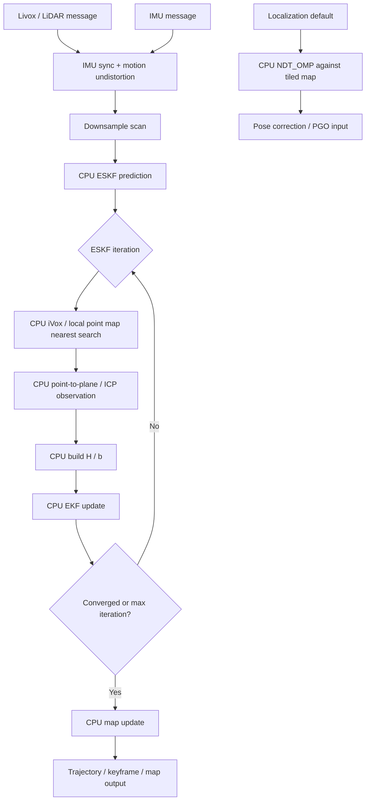
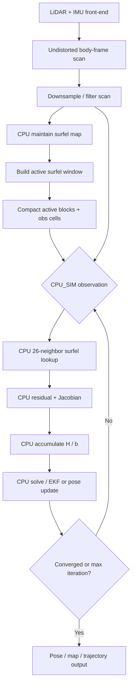
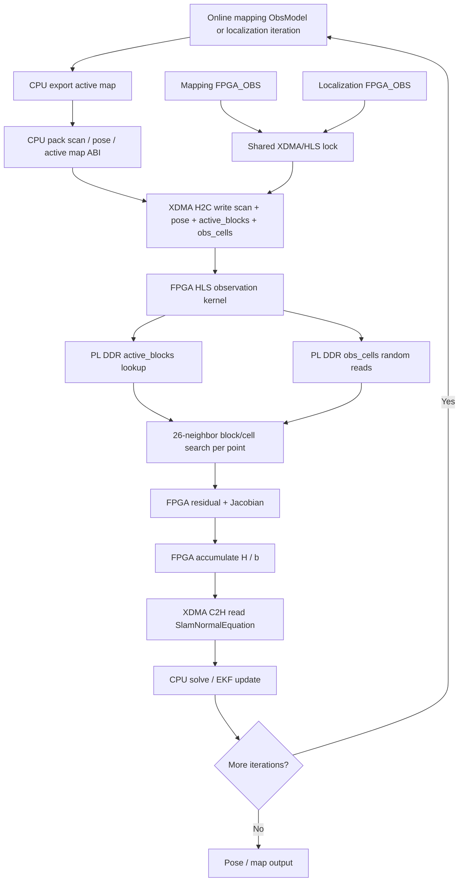
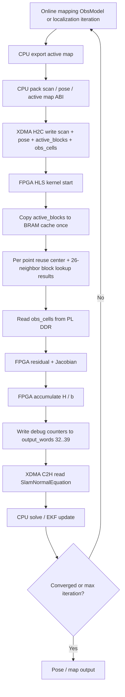
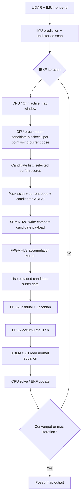

# Lightning-LM / Surfel / FPGA 五版算法流程对比

本文用于对比五个阶段的算法数据流、CPU/FPGA 分工和当前性能瓶颈：

1. 原版 Lightning-LM：无 Surfel、无 FPGA。
2. Surfel CPU_SIM：有 Surfel、无 FPGA。
3. Stage58 前 FPGA_OBS：有 FPGA，但 lookup/DDR 随机访问延迟高。
4. Stage58 后 FPGA_OBS：active-block cache 优化后。
5. ABI v2 目标版：Orin 预计算候选 block/cell，FPGA 只做 residual / Jacobian / H/b 累计。

关键实测基线：

```text
Stage57 localization baseline hls_wait ~= 1.536 s
Stage58 localization elapsed mean = 0.350090 s
Stage58 speedup ~= 4.39x
Localization golden counts = 6050/911/2
Mapping golden counts = 611/0/171
```

---

## 1. 原版 Lightning-LM：无 Surfel、无 FPGA

特点：

- 全 CPU 路径。
- 建图主要使用 CPU ESKF + iVox / 局部点云地图近邻搜索。
- 定位默认 CPU baseline 为 `NDT_OMP`。
- 没有 compact surfel active window，也没有 FPGA-friendly observation ABI。



一句话总结：

```text
稳定的 CPU baseline，但算法结构不适合直接搬到 FPGA。
```

---

## 2. Surfel CPU_SIM：有 Surfel、无 FPGA

特点：

- CPU 维护 surfel map / active window。
- observation 已经按 FPGA-friendly ABI 的思路组织。
- lookup、residual、Jacobian、H/b 累计仍全部在 CPU 上模拟。
- 这是后续 FPGA golden 和 HLS replay 的 CPU 参考。



一句话总结：

```text
算法形态已统一成 surfel observation，但还没有真实 FPGA 加速。
```

---

## 3. Stage58 前 FPGA_OBS：有 FPGA，延迟高

特点：

- mapping 和 localization 已经可以真实调用 FPGA/HLS observation。
- 每次 mapping ObsModel 或 localization iteration 都会同步启动一次 XDMA/HLS transaction。
- 每次调用会准备并写入 scan、pose、active map、output buffer。
- FPGA 在 PL DDR 中读取 `active_blocks` 和 `obs_cells`，执行 26-neighbor lookup，再累计 H/b。
- 主要瓶颈是 HLS lookup / PL DDR 随机访问；mapping 与 localization 同时打开时会竞争同一个 XDMA lock。



实测问题：

```text
Localization full-frame hls_wait ~= 1.536 s
Mapping hls_wait mean ~= 178 ms
Mapping + localization 同时打开时会出现 XDMA mutex_wait 秒级排队
```

一句话总结：

```text
功能正确，但 FPGA 在做大量随机 lookup，在线延迟不可接受。
```

---

## 4. Stage58 后 FPGA_OBS：active-block cache 优化

特点：

- 数学语义和 host-visible normal-equation ABI 不变。
- FPGA kernel 启动后，先把 `active_blocks` 拷贝到 BRAM。
- block binary search 从 BRAM cache 读取，不再每次从 PL DDR 读 `active_blocks`。
- 每个点复用 27 邻域 block-index lookup 结果。
- `obs_cells` 仍在 PL DDR，obs cell 随机读仍是主要残留瓶颈。



Stage58 Orin 实测：

```text
Localization counts = 6050/911/2 PASS
Mapping counts = 611/0/171 PASS
Localization elapsed mean = 0.350090 s
Speedup vs 1.536 s baseline ~= 4.39x
5x gate threshold = 0.307 s
```

一句话总结：

```text
active_blocks 缓存有效，但 obs_cells 随机访问仍让性能没过 5x gate。
```

---

## 5. ABI v2：Orin 预计算候选 block/cell，FPGA 只做累计

目标：

- 把不适合 FPGA 的大规模 26-neighbor 随机 lookup 前移到 Orin/CPU。
- FPGA 不再为每个点反复查 active block 和 obs cell。
- FPGA 专注做规则、密集、可流水的 residual / Jacobian / H/b accumulation。



预期收益：

```text
减少 FPGA 端 block_lookup_count
减少 obs_cell_read_count
减少 PL DDR random read
降低 hls_wait
保留 CPU solve/update 和现有 fallback 策略
```

一句话总结：

```text
Orin 做不规则查找，FPGA 做规则累计，这是下一步最有希望的实时化方向。
```

---

## 五版差异总表

| 版本 | 是否使用 Surfel | 是否使用 FPGA | Map / active window 表示 | Observation 在哪里算 | CPU 负责什么 | FPGA 负责什么 | 当前主要瓶颈 | 当前状态 / 结论 |
|---|---:|---:|---|---|---|---|---|---|
| 1. 原版 Lightning-LM | 否 | 否 | iVox / 局部点云地图 | CPU | 前端、近邻搜索、observation、solve、地图更新 | 无 | CPU 算力和传统近邻搜索 | 稳定 CPU baseline，但不 FPGA-friendly |
| 2. Surfel CPU_SIM | 是 | 否 | CPU surfel map + active blocks/cells | CPU | active window、surfel lookup、H/b、solve/update | 无 | CPU lookup 和累计 | FPGA golden 的 CPU 参考路径 |
| 3. Stage58 前 FPGA_OBS | 是 | 是 | active blocks + obs cells 全量写入 PL DDR | FPGA observation，CPU solve/update | 导出 active map、H2C/C2H、solve/update、fallback | 26-neighbor lookup、residual/Jacobian/H/b | HLS lookup + PL DDR 随机访问；XDMA lock 排队 | 功能正确但延迟高，定位约 1.536s |
| 4. Stage58 后 FPGA_OBS | 是 | 是 | active blocks BRAM cache + obs cells PL DDR | FPGA observation，CPU solve/update | 同上，另记录 debug counters | active_blocks cache、复用 block lookup、H/b | obs_cells 仍随机读；未过 5x gate | 正确性 PASS，定位约 0.350s，约 4.39x |
| 5. ABI v2 目标版 | 是 | 是 | Orin 预计算候选 block/cell / candidate list | FPGA 只做候选上的 residual/Jacobian/H/b | 不规则 lookup、candidate 生成、solve/update、fallback | 规则数值累计 | candidate ABI 设计和传输规模 | 下一步推荐方向，目标绕开 FPGA 随机 lookup |

---

## 关键区别一句话版

```text
原版：CPU 自己查点云地图，CPU 自己算。
Surfel CPU_SIM：CPU 用 surfel 结构模拟未来 FPGA 要算的 observation。
Stage58 前 FPGA：FPGA 接手 observation，但还在 FPGA 里做大量随机 lookup，所以慢。
Stage58 后 FPGA：FPGA 缓存 active_blocks，快了很多，但 obs_cells 随机读还慢。
ABI v2：CPU/Orin 先把候选找好，FPGA 只做最适合硬件流水的数值累计。
```

---

## Stage62 / Stage65 Addendum

### Version 6: ABI V2 + FPGA solve6x6

This version keeps Stage61 Candidate ABI V2 as the observation path:

```text
Orin candidate precompute
-> FPGA residual/Jacobian/H/b accumulation
-> optional FPGA localization solve6x6 dx
-> CPU pose apply / convergence / fallback
```

Boundary:

- FPGA solves only the localization 6x6 normal equation.
- CPU still applies `SE3::exp(dx) * pose`.
- CPU still owns convergence checks, quality gates, and fallback.
- Mapping ESKF update is not included in Version 6.

Current status:

```text
Windows HLS CSim/C Synthesis/IP export: PASS
Board synthesis/implementation/bitstream: PASS
Stage62 Orin golden: PASS
localization V2 counts: 6050/911/2
FPGA solve6x6: PASS, status=1
solve dx max_abs=6.93889e-18, max_rel=6.93889e-18
localization elapsed mean: 0.120442 s
mapping V2 regression: PASS, counts 611/0/171
Stage63 online SURFEL_FPGA_OBS_SOLVE smoke: PASS
online backend: SURFEL_FPGA_OBS_SOLVE
online solve calls: 46
online hls_wait mean: 118.972 ms
online xdma total mean: 121.033 ms
online fallback_cpu_sim/fallback_ndt: 0/0
```

### Version 7: ABI V2 + FPGA EKF update

This version is planned after the Stage64 CPU golden refactor:

```text
FPGA observation V2
-> dedicated FPGA EKF update core
-> CPU policy/fallback and unsupported observation handling
```

Boundary:

- EKF update must be a separate HLS IP, not part of `unified_surfel_observation_core`.
- First version only targets fixed lidar/surfel pose observation update.
- If full 23D covariance update is too expensive, first land FPGA solve/update `dx` and keep covariance update on CPU as `FPGA_OBS_SOLVE_PARTIAL`.

Current preparation status:

```text
Stage64 Mapping ESKF Update CPU Golden: PASS
golden: fpga/golden/mapping_update/frame_000001
MAPPING_ESKF_UPDATE_CPU_REPLAY_PASS
dx_max_abs=0
cov_max_abs=0
state_max_abs=6.50049e-20
```
